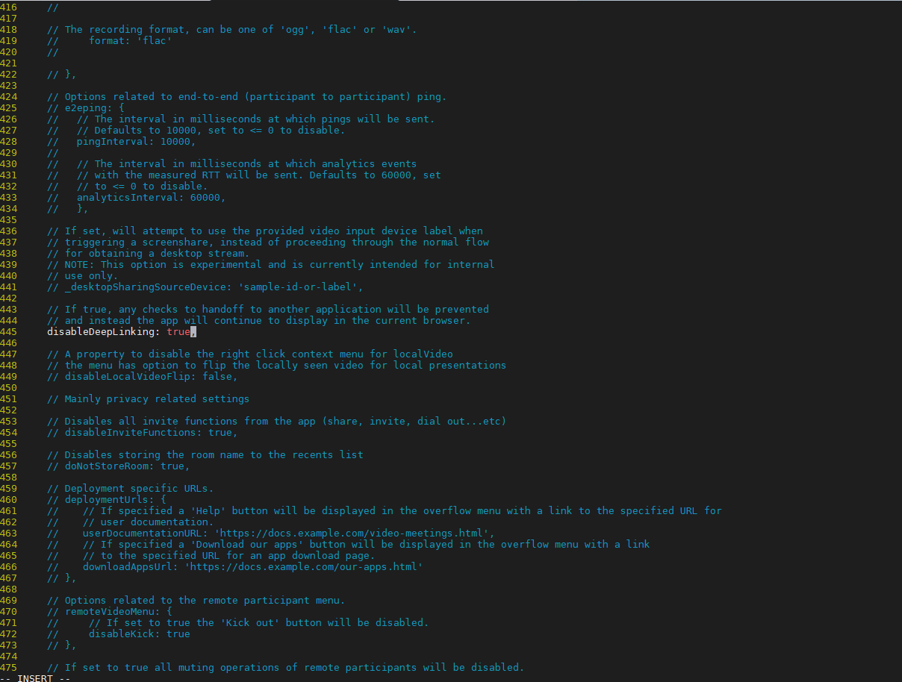

## Hướng dẫn truy cập meet trên trình duyệt của điện thoại

Cuộc họp được tạo ra có thể được truy cập bằng trình duyệt web của máy tính, app trên di động. Ngoài ra còn có thể truy cập được thông qua trình duyệt ở điện thoại khi không muốn cài đặt app.

Chỉnh sửa file `/etc/jitsi/meet/chichchich.xyz-config.js` Thay thế tương ứng với domain.

Tìm tới dòng 445 `// disableDeepLinking: false,`  bỏ comment và sửa thành true

Truy cập trên trình duyệt của điện thoại bình thường như trên máy tính.

