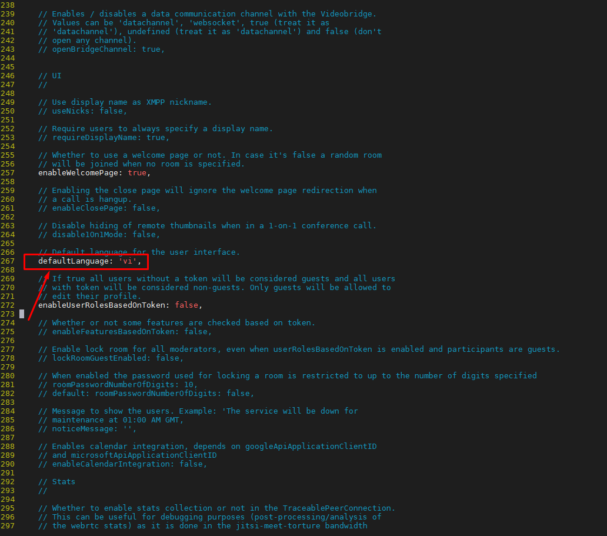
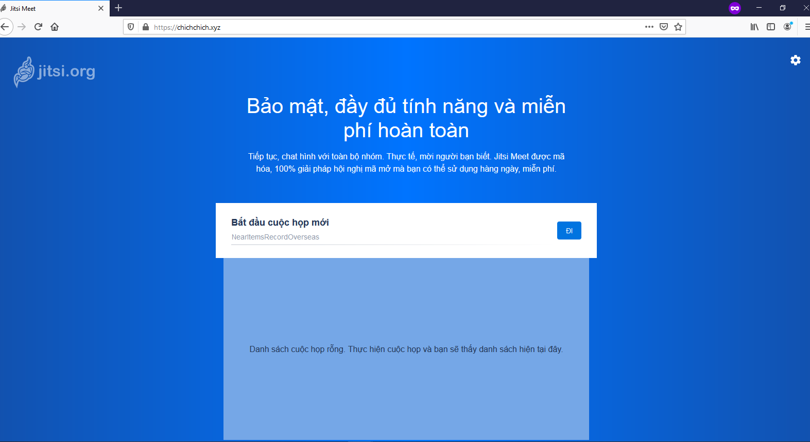
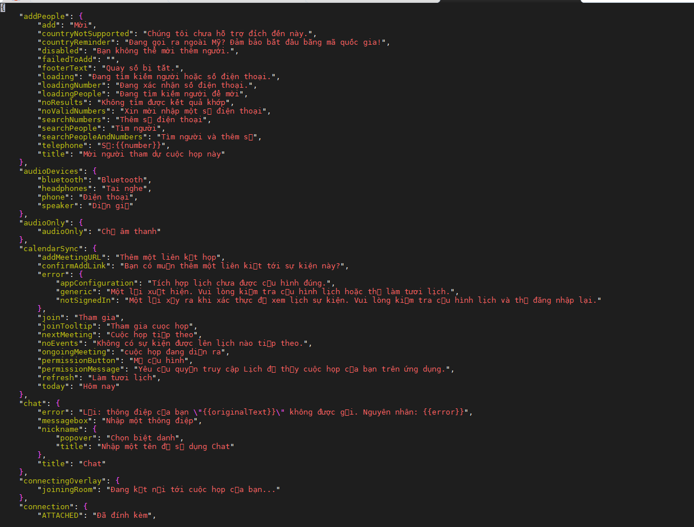
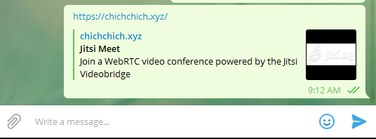
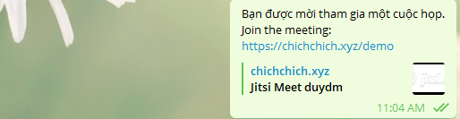
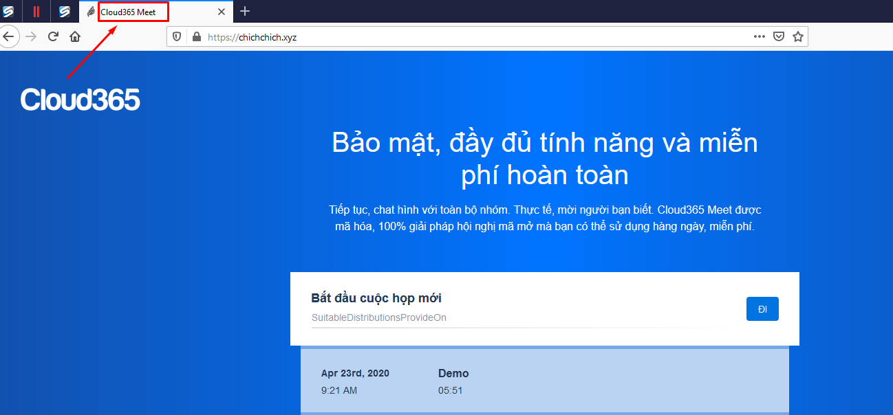
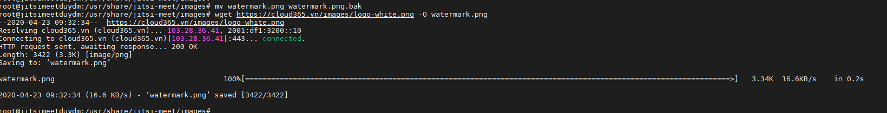
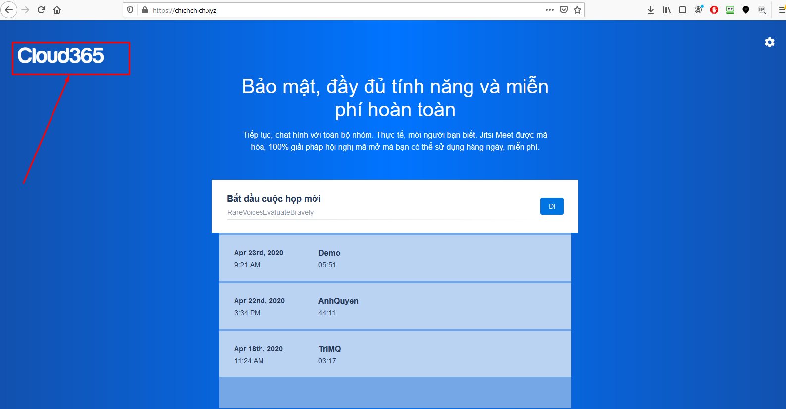
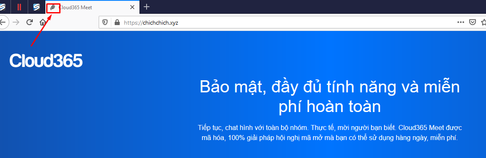
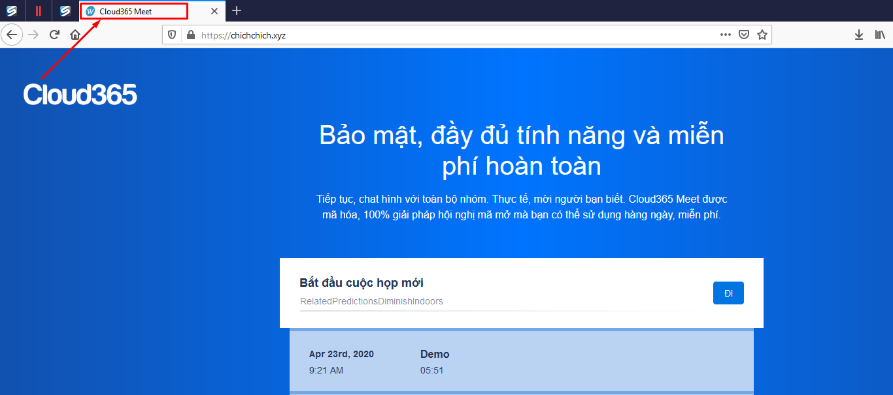

## Ghi chép một số tính năng tùy chỉnh


### 1. Chỉnh sửa ngôn ngữ mặc định tiếng Việt

Tìm file config của jitsi để chỉnh cấu hình `/etc/jitsi/meet/chichchich.xyz-config.js`

`chichchich.xyz` thay bằng domain cần cấu hình.

Chỉnh sửa tại dòng 267 `defaultLanguage`, bỏ comment và sửa `en` thành `vi`



Hoặc dùng lệnh thay thế.

```
sed -i "s|// defaultLanguage: 'en',|defaultLanguage: 'vi',|g" /etc/jitsi/meet/chichchich.xyz-config.js
```



Chỉnh phần ngôn ngữ ở trên sẽ dịch sang tiếng việt dịch không được sát nghĩa, có thể tùy chỉnh thêm để dịch sát nghĩa hơn trong file `/usr/share/jitsi-meet/lang/main-vi.json`



Tham khảo nội dụng file json tiếng Việt tại đây. <a href="https://github.com/domanhduy/ghichep/blob/master/DuyDM/WFH/Jitsi/scripts/main-vi.json">tại đây!</a>

### 2. Thay đổi một số title

Mặc định khi gửi link cuộc họp cho người khác sẽ có đoạn tiếng anh để mô tả nhanh cuộc họp và mời người khác click vào.

`Join a WebRTC video conference powered by the Jitsi Videobridge`



Có thể sửa tùy ý ở file `/usr/share/jitsi-meet/title.html`



```
/etc/init.d/jicofo restart
/etc/init.d/prosody restart
/etc/init.d/jitsi-videobridge restart
/etc/init.d/jitsi-videobridge2 restart
```

- Sửa title thì sửa giá trị biến `APP_NAME` `NATIVE_APP_NAME` trong file `/usr/share/jitsi-meet/interface_config.js`



### 3. Thay đổi logo

Thay thế logo tại file `/usr/share/jitsi-meet/images/watermark.png`

Tên ảnh phải là `watermark.png`, đưa ảnh mong muốn lên và đổi tên thành `watermark.png`





### 4. Thay đổi favicon



Chuẩn bị icon cho favicon và thay thế ở `/usr/share/jitsi-meet/images/favicon.ico`

Ctrl + Shift + R và kiểm tra lại. 




