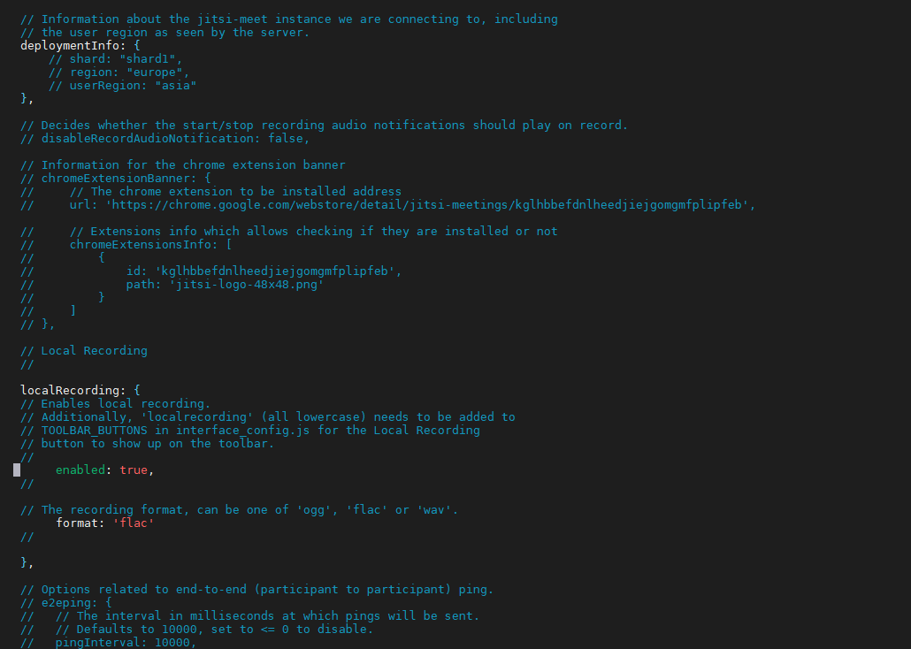
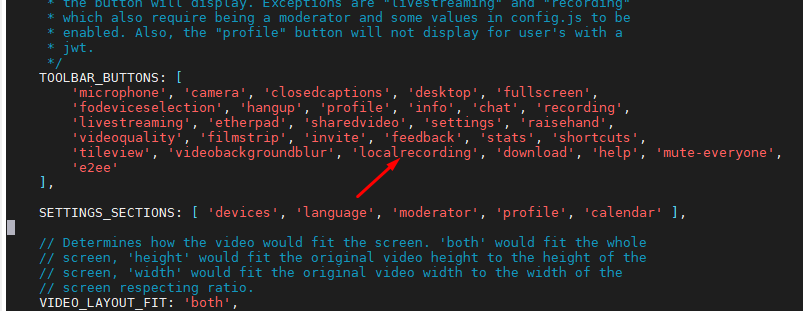
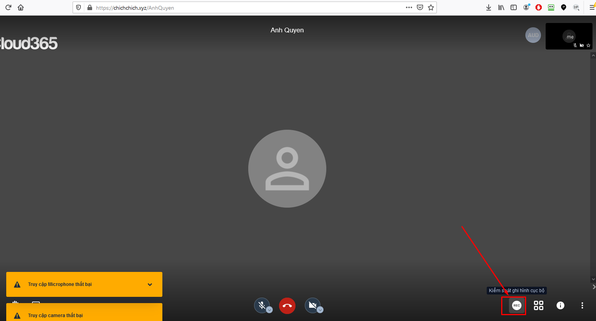
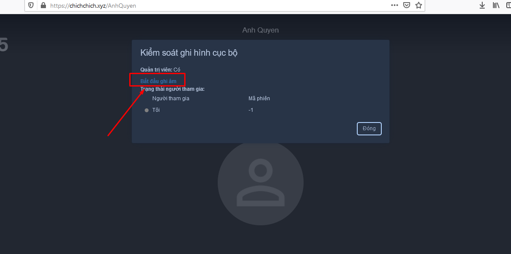

### Tính năng ghi âm cuộc họp

- Tính năng ghi âm cuộc họp sau đó tự động tải file ghi âm về máy của tất cả mọi người trong cuộc họp.

- Chỉ ghi âm được âm riêng của mỗi người tham gia họp, không ghi âm được âm thành tổng cả cuộc họp.

- Không hỗ trợ trên app di động.

- Bật tính năng ghi hình như sau:

Chỉnh sửa trong file `/etc/jitsi/meet/chichchich.xyz-config.js` Tìm tới dòng `localRecording` sửa như cấu hình bên dưới.

```
localRecording: {
// Enables local recording.
// Additionally, 'localrecording' (all lowercase) needs to be added to
// TOOLBAR_BUTTONS in interface_config.js for the Local Recording
// button to show up on the toolbar.
     enabled: true,
// The recording format, can be one of 'ogg', 'flac' or 'wav'.
     format: 'flac'
 },
```




Trường format: 'flac' hoặc format: 'ogg' hoặc format: 'wav'. Đây là các định dạng file âm thanh có thể lựa chọn.

- Bổ sung config để hiện thị trên giao diện

Sửa file `/usr/share/jitsi-meet/interface_config.js`

Phần `TOOLBAR_BUTTONS` bổ sung thêm `localrecording` nếu còn thiếu



- Sử dụng: Người tạo phòng là người duy nhất có thể dùng tính năng ghi âm trong phòng.






