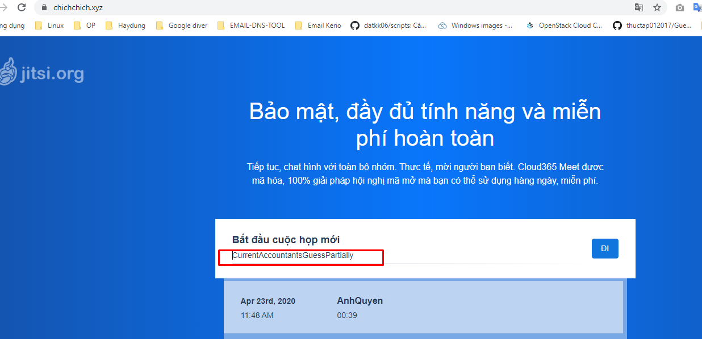
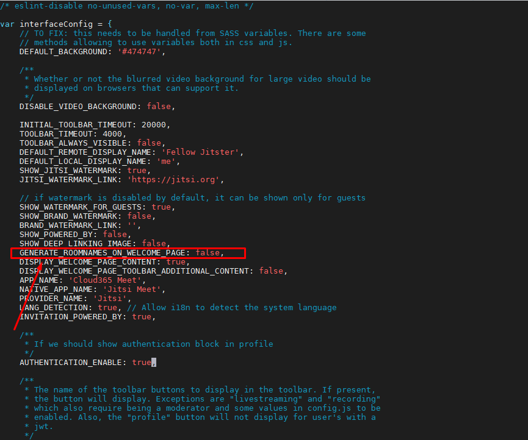
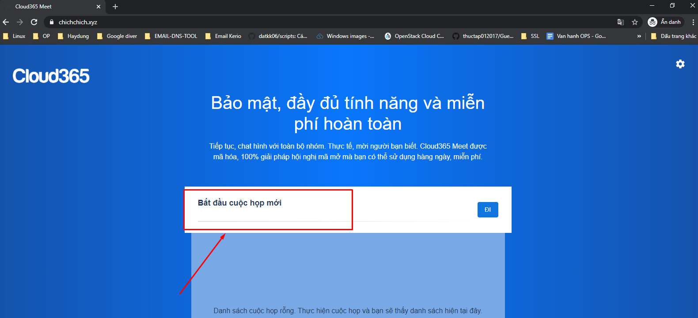
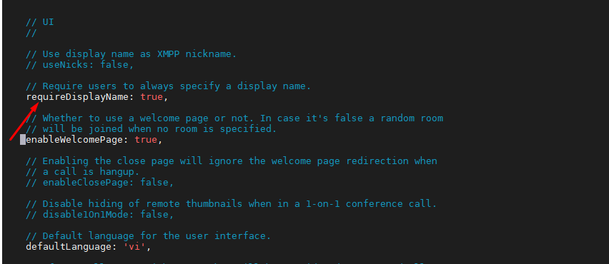
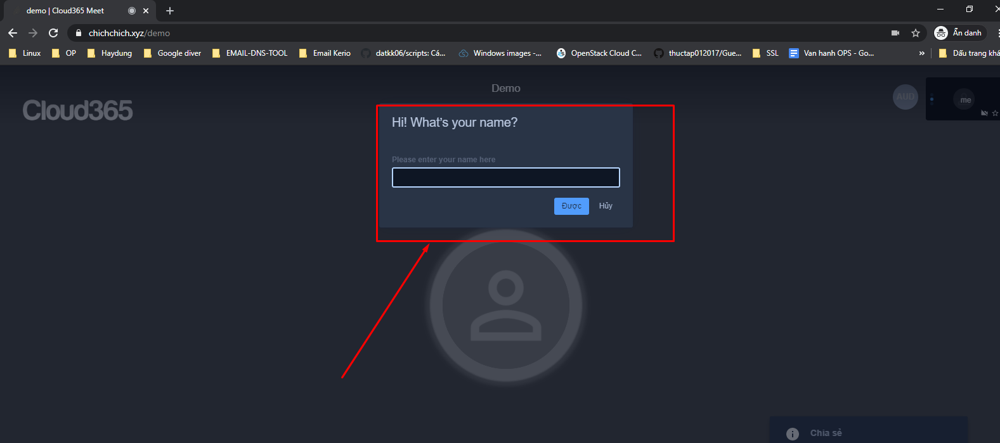
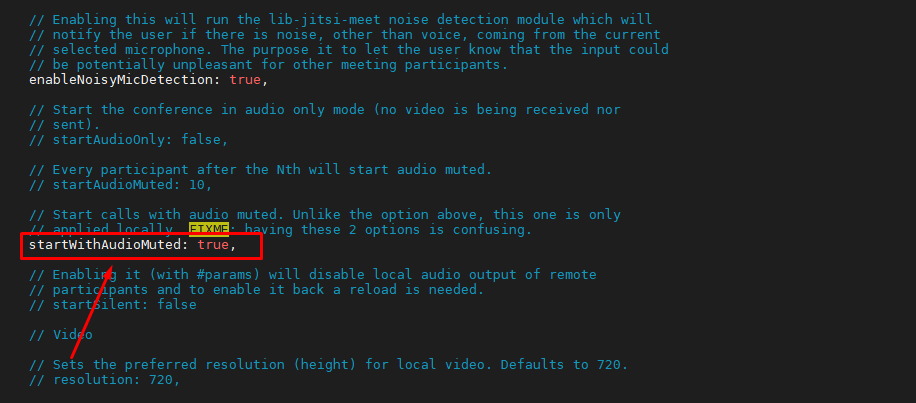
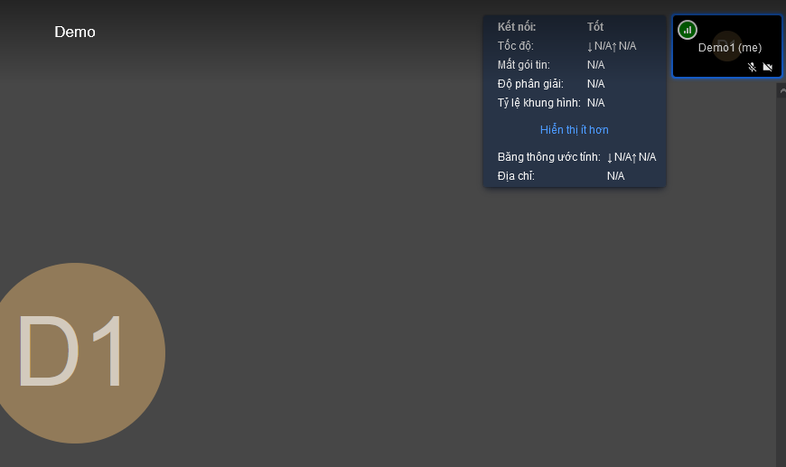
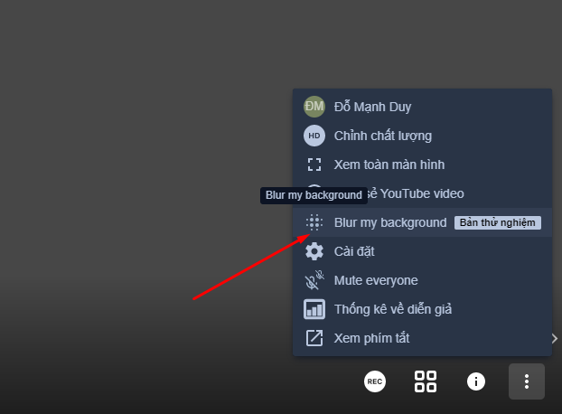
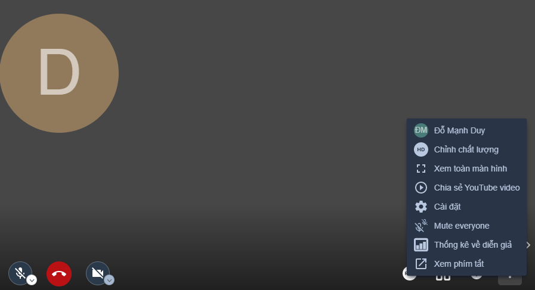
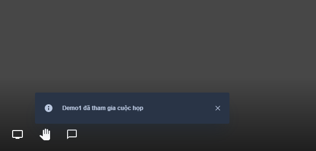

## Các tính năng nâng cao Jitsi


### 1. Tắt tự động đặt tên phòng

- Tự động đặt tên phòng là tính năng jitsi gơi ý đặt tên nếu không đặt tên lại mà ấn tạo luôn sẽ tạo và đi tới phòng luôn.



Tại file `/usr/share/jitsi-meet/interface_config.js`, tìm đến dòng `GENERATE_ROOMNAMES_ON_WELCOME_PAGE` sửa giá trị `true` sang `false`





### 2. Yêu cầu người dùng nhập tên trước khi vào phòng họp

Chỉnh sửa file `/etc/jitsi/meet/chichchich.xyz-config.js` bỏ comment dòng `requireDisplayName: true,`





### 3. Cấu hình truy cập được vào bằng trình duyệt trên điện thoại không sử dụng app

`/etc/jitsi/meet/chichchich.xyz-config.js` bỏ comment và sửa `startWithAudioMuted: true`


### 3. Tắt camera của người vào phòng khi họ mới vào phòng

Chỉnh sửa file `/etc/jitsi/meet/chichchich.xyz-config.js`

Bỏ comment và sửa `startWithAudioMuted` thành `true`



### 4. Tắt audio level

Tối ưu khi client có tốc độ mạng chậm



Chỉnh sửa file `/etc/jitsi/meet/chichchich.xyz-config.js`

Bỏ comment và sửa `disableAudioLevels` thành `true`

### 5. Tắt làm mờ background video



Chỉnh sửa ở file `/usr/share/jitsi-meet/interface_config.js`

`DISABLE_VIDEO_BACKGROUND` thành `true`

xóa `videobackgroundblur` tại mục `TOOLBAR_BUTTONS` để bỏ chức năng làm mờ background



### 6. Tắt thông báo khi có người vào phòng, thoát khỏi phòng



Chỉnh sửa file `/usr/share/jitsi-meet/interface_config.js` chỉnh sửa `DISABLE_JOIN_LEAVE_NOTIFICATIONS` thành `true`


```
sudo service prosody restart
sudo service jicofo restart
```


