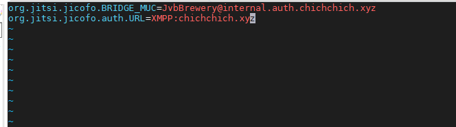

## Ghi chép tính năng chủ trì trong Jitsi

Sau khi cài đặt xong jitsi bất kỳ ai có đường link domain thì cũng có thể vào tạo phòng họp được. Để hạn chế sự bất tiện này phải cấu hình thêm tính năng người chủ trí, phải có người chủ trì thì phiên họp mới có thể bắt đầu. Tất cả những user khác sẽ không có quyền thực hiện thao tác trên trang khi có được đường link domain.


- Sửa file 

`/etc/prosody/conf.avail/chichchich.xyz.cfg.lua`

Tại phần VirtualHost "chichchich.xyz". Sửa mục authentication thành giá trị `internal_plain`


Thêm đoạn ở dưới vào cuối file 

```
VirtualHost "guest.chichchich.xyz"
        authentication = "anonymous"
        c2s_require_encryption = false
```


- Sửa file

`/etc/jitsi/meet/chichchich.xyz-config.js`

Tìm đến dòng config `anonymousdomain` sửa như dưới.


- Sửa file `/etc/jitsi/jicofo/sip-communicator.properties`

Thêm dòng cấu hình

```
org.jitsi.jicofo.auth.URL=XMPP:<IP_OR_DOMAIN>
```

```
org.jitsi.jicofo.auth.URL=XMPP:chichchich.xyz
```



- Restart lại service

```
sudo service prosody restart
sudo service jicofo restart
```

- Thêm tài khoản có quyền chủ trì

Cú pháp `sudo prosodyctl register <USERNAME> <IP_OR_DOMAIN> <PASSWORD>`

```
sudo prosodyctl register duydm chichchich.xyz Welcome123
```

- Kiểm tra kết quả


Nếu chủ trì thoát khỏi phòng thì cuộc họp sẽ chấm dứt ngay lập tức.

- Có thể thay thế việc gợi ý login bằng dòng chữ domain khác.


Sửa file `app.bundle.min.map` và `app.bundle.min.js` tại thư mục `/usr/share/jitsi-meet/libs`

```
sed -i 's/user@domain.net/user@chichchich.xyz/g' /usr/share/jitsi-meet/libs/app.bundle.min.map
sed -i 's/user@domain.net/user@chichchich.xyz/g' /usr/share/jitsi-meet/libs/app.bundle.min.js
```


