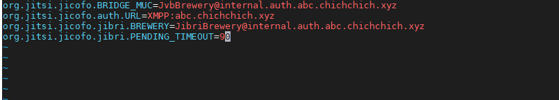
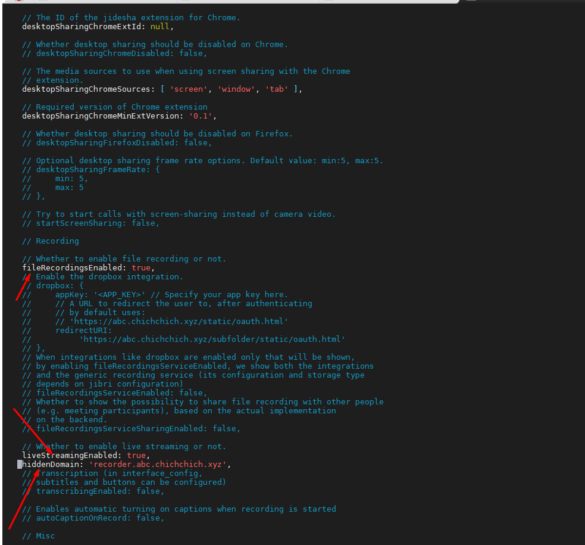
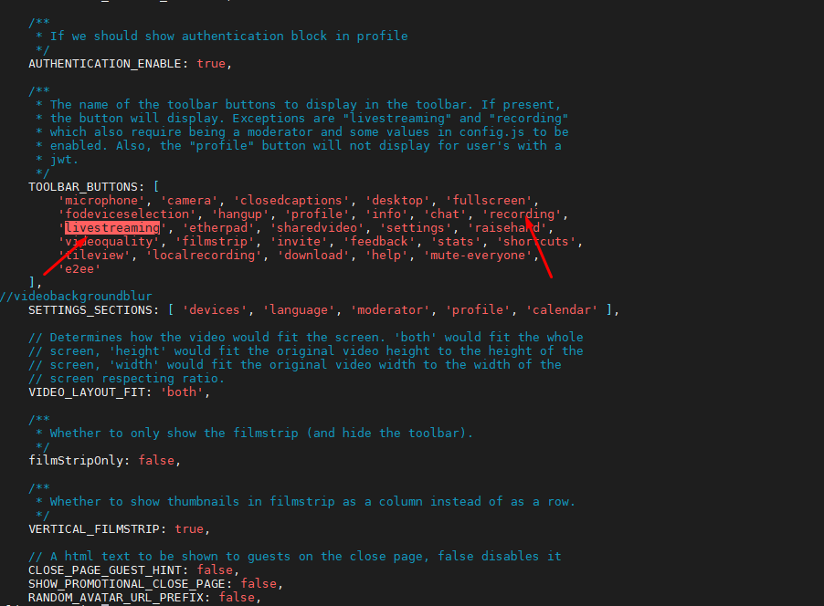
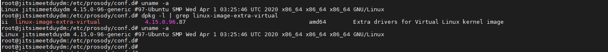
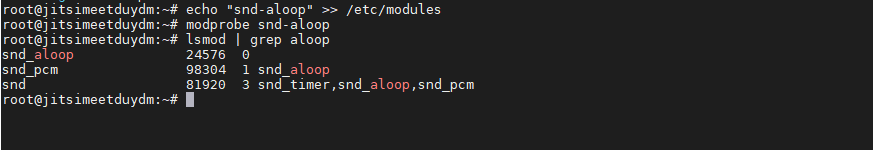
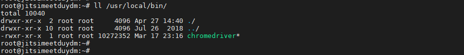
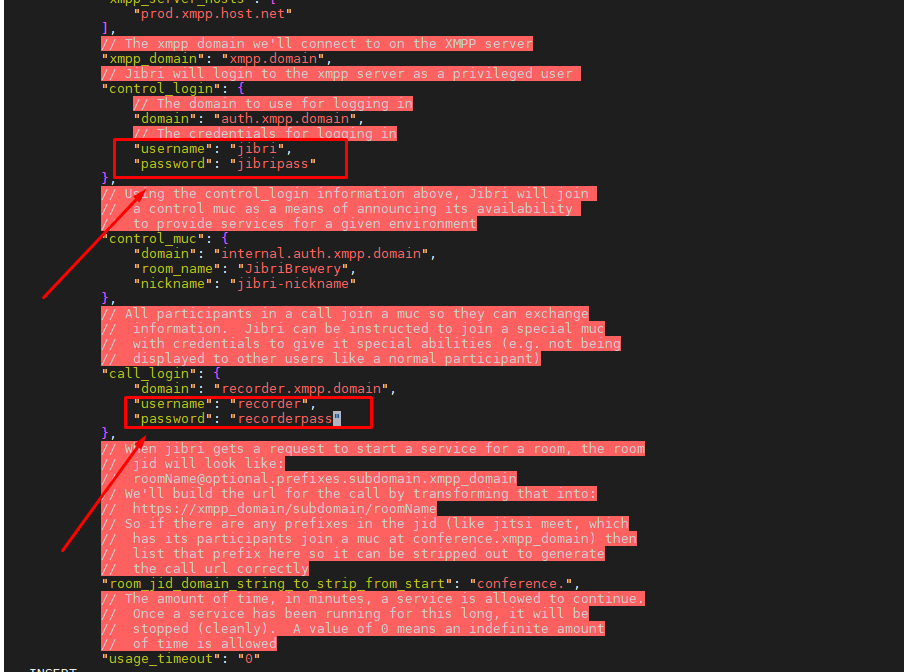
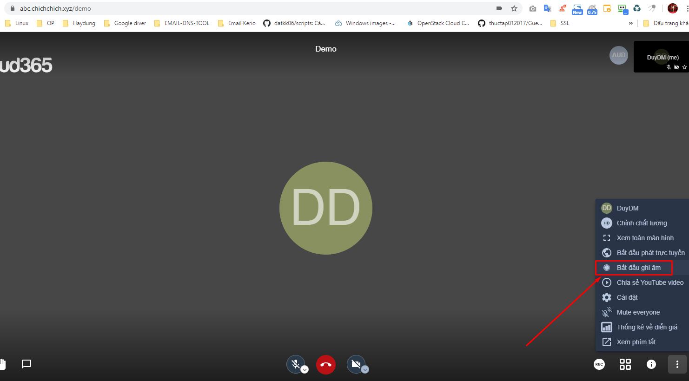
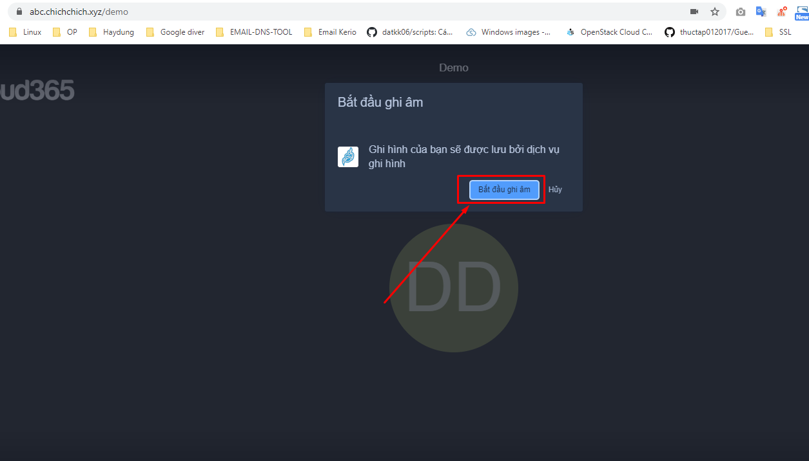

## Ghi chép tính năng ghi hình

### 1. Chỉnh sửa config prosody

`/etc/prosody/conf.d/abc.chichchich.xyz.cfg.lua`

```
plugin_paths = { "/usr/share/jitsi-meet/prosody-plugins/" }

-- domain mapper options, must at least have domain base set to use the mapper
muc_mapper_domain_base = "abc.chichchich.xyz";

turncredentials_secret = "mLCWsqSOKZXAsFMs";

turncredentials = {
  { type = "stun", host = "abc.chichchich.xyz", port = "4446" },
  { type = "turn", host = "abc.chichchich.xyz", port = "4446", transport = "udp" },
  { type = "turns", host = "abc.chichchich.xyz", port = "443", transport = "tcp" }
};

cross_domain_bosh = false;
consider_bosh_secure = true;

VirtualHost "abc.chichchich.xyz"
        -- enabled = false -- Remove this line to enable this host
        authentication = "internal_plain"
        -- Properties below are modified by jitsi-meet-tokens package config
        -- and authentication above is switched to "token"
        --app_id="example_app_id"
        --app_secret="example_app_secret"
        -- Assign this host a certificate for TLS, otherwise it would use the one
        -- set in the global section (if any).
        -- Note that old-style SSL on port 5223 only supports one certificate, and will always
        -- use the global one.
        ssl = {
                key = "/etc/prosody/certs/abc.chichchich.xyz.key";
                certificate = "/etc/prosody/certs/abc.chichchich.xyz.crt";
        }
        speakerstats_component = "speakerstats.abc.chichchich.xyz"
        conference_duration_component = "conferenceduration.abc.chichchich.xyz"
        -- we need bosh
        modules_enabled = {
            "bosh";
            "pubsub";
            "ping"; -- Enable mod_ping
            "speakerstats";
            "turncredentials";
            "conference_duration";
        }
        c2s_require_encryption = false

Component "conference.abc.chichchich.xyz" "muc"
    storage = "none"
    modules_enabled = {
        "muc_meeting_id";
        "muc_domain_mapper";
        -- "token_verification";
    }
    admins = { "focus@auth.abc.chichchich.xyz" }
    muc_room_locking = false
    muc_room_default_public_jids = true

-- internal muc component
Component "internal.auth.abc.chichchich.xyz" "muc"
    storage = "none"
    modules_enabled = {
      "ping";
    }
    admins = { "focus@auth.abc.chichchich.xyz", "jvb@auth.abc.chichchich.xyz" }
    muc_room_locking = false
    muc_room_default_public_jids = true

VirtualHost "auth.abc.chichchich.xyz"
    ssl = {
        key = "/etc/prosody/certs/auth.abc.chichchich.xyz.key";
        certificate = "/etc/prosody/certs/auth.abc.chichchich.xyz.crt";
    }
    authentication = "internal_plain"

Component "focus.abc.chichchich.xyz"
    component_secret = "9KU@eXZd"

Component "speakerstats.abc.chichchich.xyz" "speakerstats_component"
    muc_component = "conference.abc.chichchich.xyz"

Component "conferenceduration.abc.chichchich.xyz" "conference_duration_component"
    muc_component = "conference.abc.chichchich.xyz"

VirtualHost "guest.abc.chichchich.xyz"
        authentication = "anonymous"
        c2s_require_encryption = false

VirtualHost "recorder.abc.chichchich.xyz"
    modules_enabled = {
        "ping";
    }
    authentication = "internal_plain"
```


```
/etc/init.d/prosody reload
```

- Tạo các tài khoản để control record

```
prosodyctl register jibri auth.abc.chichchich.xyz jibripass
prosodyctl register recorder recorder.abc.chichchich.xyz recorderpass
```

### 2.Cấu hình jicofo

Sửa file `/etc/jitsi/jicofo/sip-communicator.properties`

Thêm các dòng sau

```
org.jitsi.jicofo.jibri.BREWERY=JibriBrewery@internal.auth.abc.chichchich.xyz
org.jitsi.jicofo.jibri.PENDING_TIMEOUT=90
```



```
/etc/init.d/jicofo restart
```

- Cấu hình Jitsi

`/etc/jitsi/meet/abc.chichchich.xyz-config.js`

Tìm và bỏ comment, sửa các dòng sau

```
fileRecordingsEnabled: true,
liveStreamingEnabled: true,
hiddenDomain: 'recorder.abc.chichchich.xyz',
```



Chỉnh sửa file `/usr/share/jitsi-meet/interface_config.js` phần `TOOLBAR_BUTTONS` bổ sung nếu chưa có 2 giá trị sau `'recording', 'livestreaming'`




### 3. Cài đặt Jibri

**Bước 1: Cài đặt các gói cần thiết**

**Lưu ý**: cần phải cài phiên bản phù hợp với kernel

```
apt update -y
apt -y install linux-image-extra-virtual
```

Kiểm tra 

```
uname -a
dpkg -l | grep linux-image-extra-virtual
```




Load module to enable record audio

```
echo "snd-aloop" >> /etc/modules
modprobe snd-aloop
```

Kiểm tra

```
lsmod | grep aloop
```




Cài đặt Google Chrome và Chrome driver

```
apt -y install unzip
cd && wget -qO - https://dl-ssl.google.com/linux/linux_signing_key.pub | apt-key add -
echo "deb [arch=amd64] http://dl.google.com/linux/chrome/deb/ stable main" > /etc/apt/sources.list.d/google-chrome.list
apt update -y
apt -y install google-chrome-stable
```

Ẩn cảnh báo Chrome

```
mkdir -p /etc/opt/chrome/policies/managed
 
echo '{ "CommandLineFlagSecurityWarningsEnabled": false }' >>/etc/opt/chrome/policies/managed/managed_policies.json
```

Cài đặt Chrome driver mới nhất

```
apt -y install curl
 
CHROME_DRIVER_VERSION=`curl -sS chromedriver.storage.googleapis.com/LATEST_RELEASE`
 
wget http://chromedriver.storage.googleapis.com/$CHROME_DRIVER_VERSION/chromedriver_linux64.zip
 
unzip chromedriver_linux64.zip -d /usr/local/bin/
 
rm -f chromedriver_linux64.zip
 
chown root:root /usr/local/bin/chromedriver
 
chmod 0755 /usr/local/bin/chromedriver
```

Kiểm tra thư mục giải nén

```
ll /usr/local/bin/
```



Cài đặt file driver thành công xóa file nén đã tải về

```
rm -f /root/chromedriver_linux64.zip
```

**Bước 2 : Cài đặt Jibri**

Kiểm tra xem jibri đã được cài đặt hay chưa, nếu không có gòi nào là chưa cài đặt.

Cài đặt Jibri

```
wget -qO - https://download.jitsi.org/jitsi-key.gpg.key | apt-key add -
echo "deb https://download.jitsi.org unstable/" > /etc/apt/sources.list.d/jitsi-unstable.list
apt update
apt -y install jibri
```

**Bước 3: Cấu hình Jibri**

```
cp /etc/jitsi/jibri/config.json /etc/jitsi/jibri/config.json.bak
```

Sửa file cấu hình `/etc/jitsi/jibri/config.json`

Chỉnh sửa các dòng sau: Mục `control_login` và `call_login` thì user và password là 2 tài khoản ta tạo ở trên, chính là tài khoản để control record đã tạo.

```
jibri/jibripass
recorder/recorderpass
```



Tạo và phân quyền thư mục để chứa các file record

```
mkdir /srv/recordings
chown jibri:jitsi /srv/recordings/
```

```
service jibri restart
service jibri status
systemctl enable jibri
```

```
/etc/init.d/jitsi-videobridge restart
/etc/init.d/jitsi-videobridge2 restart
```

Kiểm tra






