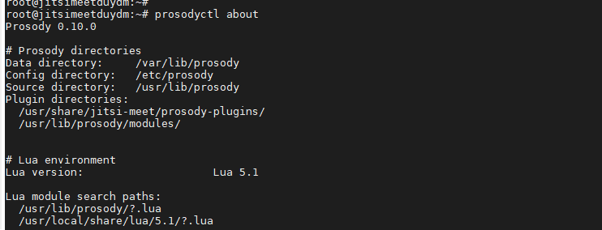
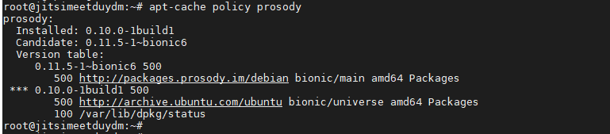
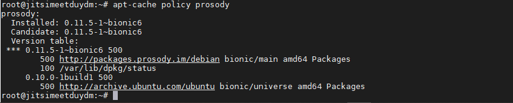
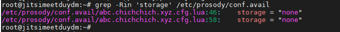
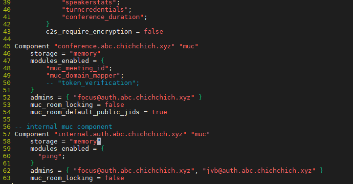
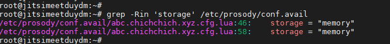
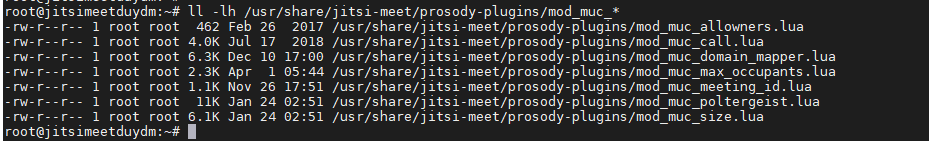
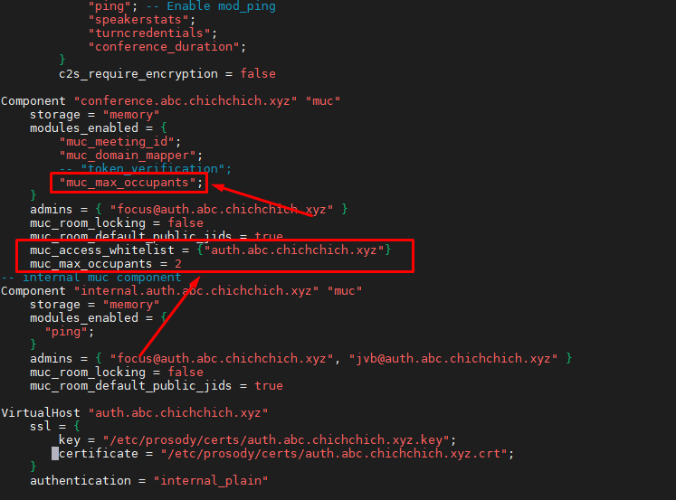

## Ghi chép giới hạn số người trong phòng họp


###1. Nâng cấp version prosody

Mặc định Version cài đặt Jitsi là 0.10.0, để giới hạn được số người truy cập mỗi phòng ta cần upgrade lên version 0.11.5

```
prosodyctl about
```



- Chỉ định repo chứa phiên bản

```
echo deb http://packages.prosody.im/debian $(lsb_release -sc) main | sudo tee -a /etc/apt/sources.list
wget https://prosody.im/files/prosody-debian-packages.key -O- | sudo apt-key add -
sudo apt-get update -y
```

- Kiểm tra lại version prosody vừa chỉ định về và update



```
sudo apt-get update -y
sudo apt-get install prosody -y
```

```
apt-cache policy prosody
```




###2. Cấu hình Prosody

Sau khi nâng cấp prosody sẽ bỏ qua hết các Virtualhost của bản trước, cần thêm lại giá trị này

Chỉnh sửa `/etc/prosody/prosody.cfg.lua` thêm vào cuối file

```
...
...
 
---Set up an external component (default component port is 5347)
--
-- External components allow adding various services, such as gateways/
-- transports to other networks like ICQ, MSN and Yahoo. For more info
-- see: https://prosody.im/doc/components#adding_an_external_component
--
--Component "gateway.example.com"
--      component_secret = "password"
 
Include "conf.d/*.cfg.lua"
```

- Chỉnh sửa `storage = "none"` sang `storage = "memory"` tại file

Tìm `grep -Rin 'storage' /etc/prosody/conf.avail`

```
/etc/prosody/conf.avail/abc.chichchich.xyz.cfg.lua:46:    storage = "none"
/etc/prosody/conf.avail/abc.chichchich.xyz.cfg.lua:58:    storage = "none"
```







```
/etc/init.d/prosody restart
```

### 3. Giới hạn user trên mỗi phòng

Sử dụng module mod_muc_max_occupants để giới hạn user truy cập trên phòng. Nếu cài Jitsi từ APT, module này đã có sẵn trong thư mục `/usr/share/jitsi-meet/prosody-plugins/`



- Cấu hình giới hạn người truy cập

`/etc/prosody/conf.avail/abc.chichchich.xyz.cfg.lua`

Thêm 2 dòng vào mục cấu hình

```
muc_access_whitelist = {"auth.abc.chichchich.xyz"}
muc_max_occupants = 2
```



```
/etc/init.d/prosody restart
```
